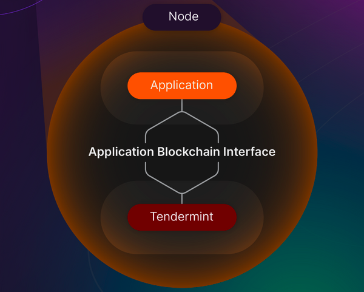

## A Blockchain App Architecture

이 섹션에서는 Cosmos SDK로 구축된 블록체인을 기반으로한 애플리케이션 아키첵쳐를 상세하게 살펴보자. 텐더민트, Cosmos의 합의, 애플리케이션 블록체인 인터페이스, Cosmos SDK, 상태머신 등...

### What is Tendermint?

텐더민트는 2014년에 생성되었고, **ready-made** 네트워크 및 합의 솔루션을 제공하면서 개별 블록체인의 개발을 앞당겼다**. 네트워킹과 합의과정은 각 경우에 대해 개발자들에 의해 다시 만들어질 필요는 없다**. 이 글을 읽는 독자는 하이퍼 렛져의 Burrow나 **[바이낸스 체인](https://academy.binance.com/en/articles/what-is-cosmos-atom)**과 같은 블록체인들 처럼 이미 인식은 하지 않았으나 텐더민트를 이미 사용하고 있을 지도 모른다.

텐더민트는 합의와 네트워킹을 수행하는 모듈이다. 어떠한 블록체인에도 두가지 중요한 컨셉이 있다. 이 모듈은 개발자가 peer 발견, 블록 전파, 합의, 트랜잭션 최종성 등과 같은 **블록체인의 낮은 레벨의 문제들로 내려가지 않고,  애플리케이션 수준에 더 집중하게 만들어 준다**. 텐더민트가 없다면, 개발자들은 애플리케이션 개발에 대해 시간, 복잡성 비용을 추가하는 위 문제들을 해결하기 위해 소프트웨어를 만드는게 강요될지도 모른다.


(텐더민트는 합의 + 네트워킹 계층과 애플리케이션 계층과 + 코스모스 계층 두개에는 ABCI가 있다.)

애플리케이션에 초점을 맞춘 코스모스 블록체인을 위한 하나의 블록체인 노드는 코스모스SDK로 개발된 상태머신과, 텐더민트 코어에 의해 처리되는 합의 및 네트워킹 레이어로 구성된다.

### ****Consensus in Tendermint Core and Cosmos****

- PBFT POS를 이용한다.
- ATOM을 스테이킹하고 node를 돌려야한다.
- 오직 Top 150개의 노드만 검증자로 트랜잭션 최종화 과정에 참여할 수 있다.
- 블록을 생성하면, voting power에 비례해서 보상을 받을 수 있음.
    - voting power = atom tokens staked + deletagted
- 블록은 다른 검증자에게 전파되며, 신속하고 정확하게 반응한다는 점을 기대할 수 있다. why?
    - 검증자는 블록 후보를 확인함
    - 검증자는 검증하지 못할대 패널티를 받음
    - 검증자는 invalid 블록을 거부할 수 있고, 거부 해야만 함
    - 검증자는 서명을 리턴하면서 블록을 수용할 수 있음
- 블록생성자로부터 충분한 서명이 모이면, 블록은 확정되고 네트워크로 전파됨
- POW랑 다르게 최종성에 대한 확률이 있지 않음.
- POW는 더 많은 참여자가 있기를 바라는 모델이라 속도가 늦다.
- Cosmos는 좋은 네트워크 상황과 헌신적인(dedicated) 노드를 기본으로 하여 더 높은 성능을 목적을 가지고 있음
- 커뮤니티로 검증자를 투표하기도 해서, 중앙화를 막을 수 있음

### ****Upgradeability of chains****

- Tendermint blockchain의 트랜잭션은 비가역적으로 확정되기 때문에, 업그레이드 또한 같은 방식으로 진행됨
- 즉 업그레이드가 동시에 일어나거나, 업그레이드의 실패 2가지로 나뉨

### Application Blochchain Interface (ABCI)

- 하나의 프로세스에서 실행되는 합의 엔진은 상태 머신을 컨트롤 하고, 애플리케이션은 또 다른 프로세스에서 실행된다.
- Tendermint BFT는 애플리케이션에 소켓 프로토콜로 연결되어 있음. 만약 애플리케이션이 다른 언어로 구현되어있으면, ABCI는 소켓을 제공한다. 텐더민트 구현체와 동일한 언어라면, 소켓은 사용하지 않는다.



- Tendermint BFT는 몇가지 보안사항들을 보장한다.
    - 절반 또는 그 이상의 벨리데이터가 정직한 경우 Forks는 절대 생성되지 않는다.
    - 트랜잭션은 블록이 생성되고 바로 확정된다.
- Tendermint는 트랜잭션의 의미에 대해 의견을 가지고 있지 않다.
- 블록 시간은 약 7초이며 수천개의 트랜잭션을 가진다.
- 트랜잭션이 확정되면, 되돌릴 수 없다.

아래는 별로 관련 없는 내용이라 다른 곳으로 빼도될것 같음(PR 올려보겠습니다~)

- 블록체인을 사용할때 애플리케이션 레벨에서 두가지 접근 방식이 있음
    - 애플리케이션 특화 블록체인을 만든다.
    - 프로그램이 가능한 상태 머신을 만들고, 더 높은 레벨에서 애플리케이션을 넣을 수 있는 블록체인을 만든다. (이더리움)
- 애플리케이션 특화 블록체인을 만들면, 일반적인 프로그램을 지원하기 위한 필수적인 turing-complete language 지원과 같은 일은 하지 않아도됨!

### The Cosmos SDK

- 개발자는 Cosmos SDK를 이용해서 애플리케이션 레이어를 만들 수 있음
- SDK가 제공하는 것
    - Scaffold
    - A Rich set of moudles : address, governance, tokens, other standards. 뭔가 오픈제플린이 제공하는 규격들이 모두 SDK에 들어있나봄.
- Cosmos SDK로 애플리케이션 특화 블록체인을 만들면, 이미 잘 만들어진 모듈들을 사용하기 쉬워짐. 개발의 범위를 줄여주어, 애플리케이션 관점에 더욱 집중할 수 있음

### State machines

- 블록체인은 복제된 상태기계임
- 상태기계 ? : 여러 상태를 가질 수 있지만, 하나의 time에 대해서는 하나의 상태만 가질 수 있음.
- 블록체인에서의 상태 변화는 트랜잭션으로 인해 일어남.
- Cosmos SDK를 이용해서 상태 기계를 만들 수 있음

### Additioanl details

**CheckTx**

- 트랜잭션을 검증하는 함수. Tendermint가 애플리케이션 레이어에게 이 함수를 호출해서 실행해도되는 트랜잭션인지 물어봄. 애플리케이션에서는 이 함수를 구현해야함

**DeliverTx**

- Tendermint는 DelivderTx를 호출해서 블록의 정보를 애플리케이션 레이어로 전달함. 애플리케이션은 이 정보를 이용해서 상태 변화를 만듦

**BeginBlock and EndBlock**

- 블록이 트랜잭션을 가지고 있지 않더라도, ABCI를 통해 두 메시지가 보내진다. 두 메시지는 연결성에 대해 확인할 수 있고, time period를 확인하는 과정에 도움이 된다.
- 이 함수를 이용해서 예약된 프로세스를 실행할 수 도 있다.

Tendermint를 합의로 사용하는 애플리케이션이라면 반드시 ABCI를 구현해야함. Cosmos SDK가 이미 기본적인것들은 제공하기 때문에 직접할필요가 없긴한데, 얼마나 아무것도 안해도되는지는 해봐야 알듯.

### 요약

- Tendermint는 합의 + 네트워킹이고, 블록이 생성과 동시에 확정되는 특징이 있음. 7초에 수천개 트랜잭션
- Cosmos SDK를 이용해서 애플리케이션을 만들 수 있음
- 애플리케이션(상태기계)을 만들때 Tendermint와 통신할 수 있도록 ABCI(CheckTx 와 같은 기능들)를 만들어야하는데, 그렇게 할일이 많지는 않음

```jsx
+---------------------+
|                     |
|     Application     |
|                     |
+--------+---+--------+
         ^   |
         |   | ABCI
         |   v
+--------+---+--------+
|                     |
|                     |
|     Tendermint      |
|                     |
|                     |
+---------------------+
```