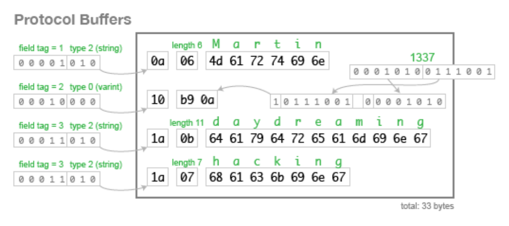

## Transactions
트랜잭션은 end-users에 의해 생성되는 오브젝트며, 애플리케이션의 상태 변경을 만든다.

### Transaction process from an end-user perspective

- Decide : 인터페이스를 통해 트랜잭션을 만들 메시지를 결정
- Generate : Cosmos SDK의 TxBuilder를 이용해서 트랜잭션을 생성
- Sign : 트랜잭션을 서명함.
- Broadcast : 서명된 트랜잭션은 이용가능한 인터페이를 이용해 전파함

Decide와 Sign은 유저와 직접 상호작용하는 부분이고, Generate와 Broadcast는 사용자 인터페이스 또는 다른 자동화에 의해 처리됨!

### Transaction objects

- 트랜잭션 오브젝트는 GetMsgs(), ValidateBasic() 를 가진 인터페이스를 구현한 오브젝트
- GetMsgs : 트랜잭션을 unwrap해서, 가지고 있는 내용을 list로 리턴함. 하나의 트랜잭션에는 하나 또는 여러가지 메시지를 가질 수 있음
- ValidateBasic : ABCI의 checkTX, deleverTx에서 사용되는 stateless checks 방법으로 트랜잭션이 valid한지 확인하는 기능.
- Tx object를 직접 수정하는 일은 없고, 트랜잭션을 생성할때 사용되는 type일 뿐. 개발자는 보통 TxBuilder를 사용하게됨

### Messages

- ABCI message와 Transaction messages는 다름
- “메시지를 읽어 상태변경하는 로직을 모듈화 할 수 있다”
- Message = sdk.Msg는 속한 모듈의 범위내에서 상태 변화를 만드는 모듈 특정 object다.
- Module을 개발하는 개발자는 Protobuf Msg service에 함수 이름을 추가해서 모듈 메시지를 정의할 수 있다
- Protobuf is a data serialization method
- sdk.Msg는 정확히 하나의 Protobuf Msg service RPC와 관계를 가진다. 이때 각 모듈에 tx.proto file에 RPC가 정의된다.
- Cosmos SDK의 app router는 자동적으로 각 sdk.Msg에 상응하는 RPC service를 맵핑해준다.
- 요런 설계는 비슷한 상태 변경 논리를 재활용 할 수 있게 해줌.
- 메시지에 상태 변경 논리가 있다면, 트랜잭션의 다른 메타데이터와 관련 정보는 TxBuilder와 Context에 저장된다.

### Signing Transactions

- 하나의 트랜잭션의 모든 메시지는 GetSigners로 얻을 수 있는 address로 서명이 되어야만 한다!
- Cosmos SDK는 트랜잭션에 서명하는 두가지 방법을 허용함
    - **SIGN_MODE_DIRECT** : 가장 많이 사용되는 구현.  ProtoBuf를 사용함
    - **SIGN_MODE_LEGACY_AMINO_JSON** : 옛날 방법

### Generating transactions

- TxBuilder 인터페이스는 트랜잭션 생성과 관련된 메타데이터를 가진다.
- end-user는 생성하고자 하는 트랜잭션의 parameters를 마음대로 설정할 수 있음
    - Msgs : 트랜잭션에 포함되는 messages array
    - GasLimit : (옵션) 지불할 용의가 있는 가스 unit
    - Memo : 트랜잭션과 함께 보내는 코멘트
    - FeeAmount : 유저가 지불할 용의가 있는 maximum fee
    - TimeoutHeight : 트랜잭션이 valid한 block height. 언제쓰이나
    - Signatures : 트랜잭션의 모든 서명인의 서명
- GasLimit vs FeeAmount
    - Fee = gas * gas-prices
- 서명하는 방법에 두가지가 있기 때문에 TxBuilder의 구현체도 2개임
    - wrapper for **SIGN_MODE_DIRECT**
    - StdTxBuilder for **SIGN_MODE_LEGACY_AMINO_JSON**
    - 두가지 방식은 end-users에게는 보통 가려지고, TxConfig에 따라 선택됨. TxConfig에 어떻게 서명해야하는지 정보가 담겨있다고함
- 새로운 TxBuilder는 txConfig.NewTxBuilder()를 통해 초기화할 수 있음.
- 아래는 예시 코드!

```jsx
txBuilder := txConfig.NewTxBuilder()
txBuilder.SetMsgs(...) // and other setters on txBuilder
```

- 아래는 [terra core에서 사용하는 예시](https://github.com/terra-money/core/blob/ee981a235683cc896c5b15fd154fdc544028ed39/custom/auth/client/rest/encode.go#L53-L59)

```jsx
txBuilder := clientCtx.TxConfig.NewTxBuilder()
txBuilder.SetFeeAmount(req.Tx.GetFee())
txBuilder.SetGasLimit(req.Tx.GetGas())
txBuilder.SetMemo(req.Tx.GetMemo())

if err := txBuilder.SetMsgs(req.Tx.GetMsgs()...); rest.CheckBadRequestError(w, err) {
	return
}
```

### Broadcasting the transaction

- 트랜잭션을 서명되면, 브로드캐스팅할때 3가지 방법이 있음
    - CLI : TxCmd 커맨드를 이용해서 구현할 수 있음.
    - gRPC : 주요로 사용하는 곳은 query services. Cosmos SDK는 몇가지 gRPC 서비스도 제공하는데 그 중 하나는 Tx 서비스임. Tx 서비스를 이용해서 트랜잭션을 시뮬레이션하거나, 쿼리 날리거나, 트랜잭션을 브로드캐스팅할 수 있음
    - REST endpoint : gRPC의 각 method는 REST endpoint를 제공하기도함. `POST` `/cosmos/tx/v1beta1/txs` 와 같은 요청이 가능함
- Tendermint RPC
    - 위 3가지 방법은 tendermint RPC의 높은 차원으로 추상화한 방법들임!
    - Tendermint RPC `/broadcast_tx_{async,sync,commit}`
     endpoints 요런식임
    - 당연히 Tendermint RPC도 브로드캐스팅할 때 이용할 수 있음.

### gRPC and protoBuf
Reference : https://grpc.io/docs/what-is-grpc/introduction/


* gRPC에서는, 클라이언트 애플리케이션이 마치 local에 연결된 것처럼 직접 서버 애플리케이션의 함수를 실행할 수 있다.
* gRPC는 원격으로 호출할 수 있는 함수들을 구체화하기 위해 서비스를 정의하는 아이디어에서 시작함.
* 서버는 gRPC interface 구현하고, gRPC server를 실행해야하며 클라이언트는 stub을 가한다.
* 아래 그림은 C++ server가 gRPC 서버를 제공하고, Ruby와 Android 클라리언트에 Stub이 있는 예시이다.
* gRPC node로 만들기 https://grpc.io/docs/languages/node/quickstart/


* gRPC에서는 기본적으로 Protocol Buffers(protoBuf)를 사용한다.
* protoBuf는 구글의 오픈소스 구조화된 데이터 직렬화 메커니즘이다.
* 원리
    * proto file(.proto)에 사용하고 싶은 데이터 구조를 정의함
    * protoc이라는 컴파일러를 이용해서 데이터 접근 클래스를 정의힌다.
    * 데이터 접근 클래스를 이용해서 버퍼 메시지를 채우고, 직렬화하고, 검색할 수 있다.

**Protocol Buf 예시**
https://jeong-pro.tistory.com/190

```
{
    "userName":"Martin",
    "favouriteNumber":1337,
    "interests":["daydreaming","hacking"]
}
```
위의 데이터를 Json으로 사용하면 82byte인데 아래와 같이 ProtocolBuf를 이용하면 33byte로 크기를 줄일 수 있음



핵심은 불필요한 속성값을 숫자로 대체해버림

* 장점
    * 데이터를 줄여서 더 빠른 통신 가능
    * json의 경우 보통 따로 parsing하기 마련인데, 포토토콜 버퍼의 바이트 그 자체를 메모리에 넣고, 그 메모리와 연결된 객체를 만들기 때문에 파싱할 필요가 없음
* 단점
    * 사람이 읽기 어렵다. 읽으려면 proto 파일이 필수
    * proto 문법을 배워야만 하고, 정의가 변경되면 proto 파일이 다시 공유되어야함!
